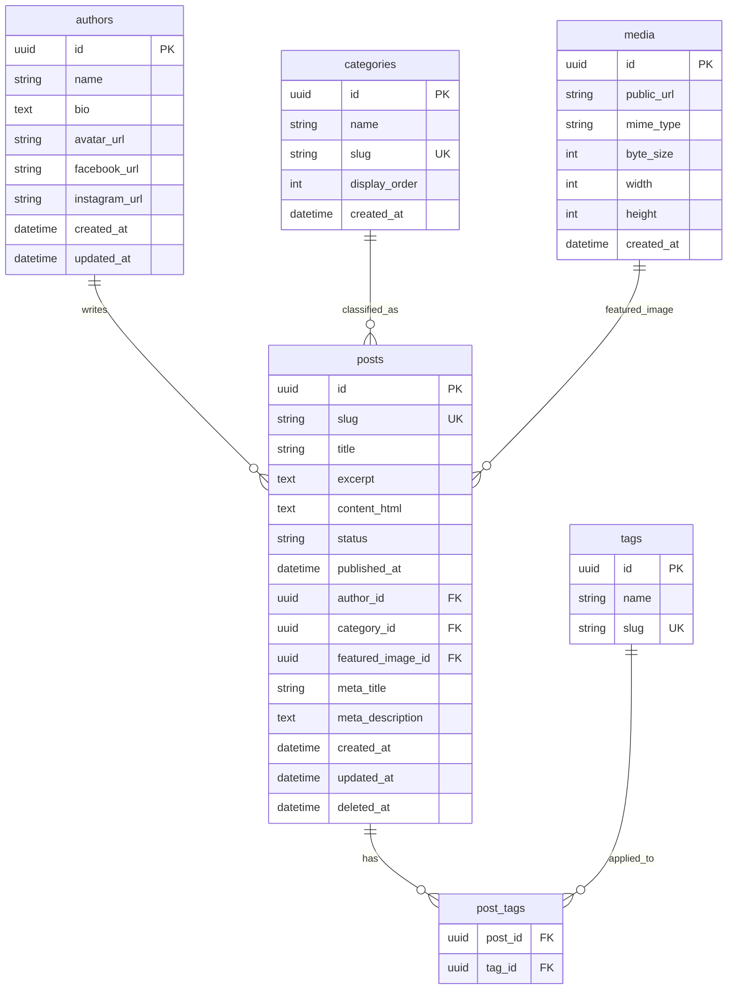

# Database documentation — Windzon blog

| Document | Version |
|----------|---------|
| 1.0 | 2026-04-09 |

**Purpose:** Describe a **relational** data model to store blog posts and related entities so content created in the **admin panel** can be served to the public website (listing, single post, homepage strip, sidebar aggregates).

**Status:** Specification only — no migrations are included in this repository unless added by a separate implementation task.

**Companion document:** [BLOG_ADMIN_PANEL_SRS.md](BLOG_ADMIN_PANEL_SRS.md) (field analysis and admin requirements).

---

## 1. Entity overview

| Entity | Description |
|--------|-------------|
| `authors` | Writer profiles: name, bio, avatar, social links for the single-post author box. |
| `categories` | Primary taxonomy (e.g. Windows Service, Doors Service) for sidebar and filters. |
| `tags` | Labels for posts; many-to-many with posts. |
| `posts` | Core article: title, slug, excerpt, HTML body, status, publish time, FKs. |
| `post_tags` | Join table: `post_id` + `tag_id`. |
| `media` | Optional: uploaded file metadata (URL, MIME, size). |

---

## 2. Entity-relationship diagram



---

## 3. Table definitions

### 3.1 `authors`

| Column | Type | Nullable | Description |
|--------|------|----------|-------------|
| `id` | UUID / BIGINT | NO | Primary key. |
| `name` | VARCHAR(255) | NO | Display name (“By Alicia Davis”). |
| `bio` | TEXT | YES | Short paragraph under author name on single post. |
| `avatar_url` | TEXT | YES | Profile image URL. |
| `facebook_url` | VARCHAR(500) | YES | Optional. |
| `instagram_url` | VARCHAR(500) | YES | Optional. |
| `created_at` | TIMESTAMP | NO | |
| `updated_at` | TIMESTAMP | NO | |

### 3.2 `categories`

| Column | Type | Nullable | Description |
|--------|------|----------|-------------|
| `id` | UUID / BIGINT | NO | Primary key. |
| `name` | VARCHAR(255) | NO | e.g. “Windows Service”. |
| `slug` | VARCHAR(255) | NO | URL-safe, unique. |
| `display_order` | INT | NO | Default 0; sidebar sort. |
| `created_at` | TIMESTAMP | NO | |

**Seed ideas** (from [blog-single.html](../blog-single.html) sidebar): Windows Service, Doors Service, Maintenance And Repair, Planning And Projects, Replace Accessories.

### 3.3 `tags`

| Column | Type | Nullable | Description |
|--------|------|----------|-------------|
| `id` | UUID / BIGINT | NO | Primary key. |
| `name` | VARCHAR(100) | NO | Display label. |
| `slug` | VARCHAR(100) | NO | Unique. |

### 3.4 `posts`

| Column | Type | Nullable | Description |
|--------|------|----------|-------------|
| `id` | UUID / BIGINT | NO | Primary key. |
| `slug` | VARCHAR(255) | NO | Unique among non-deleted posts; public URL key. |
| `title` | VARCHAR(500) | NO | |
| `excerpt` | TEXT | NO | Card + SEO snippet. |
| `content_html` | LONGTEXT | NO | Full article body. |
| `status` | VARCHAR(32) | NO | e.g. `draft`, `published`, `archived`. |
| `published_at` | TIMESTAMP | YES | Set when published; used for ordering and “Latest”. |
| `author_id` | FK → authors | NO | |
| `category_id` | FK → categories | YES | Matches template “one category” model. |
| `featured_image_id` | FK → media | YES | Card + single hero; or store URL-only in column below. |
| `featured_image_url` | TEXT | YES | Alternative if not using `media` row for featured image. |
| `meta_title` | VARCHAR(500) | YES | `<title>` override. |
| `meta_description` | TEXT | YES | Meta description tag. |
| `created_at` | TIMESTAMP | NO | |
| `updated_at` | TIMESTAMP | NO | |
| `deleted_at` | TIMESTAMP | YES | Soft delete; exclude from public queries when set. |

**Rules:**

- Public site: `status = 'published'` AND `published_at IS NOT NULL` AND `published_at <= NOW()` AND `deleted_at IS NULL`.
- Listing/homepage: `ORDER BY published_at DESC`.

### 3.5 `post_tags`

| Column | Type | Description |
|--------|------|-------------|
| `post_id` | FK → posts | ON DELETE CASCADE |
| `tag_id` | FK → tags | ON DELETE CASCADE |

Primary key: `(post_id, tag_id)`.

### 3.6 `media` (optional)

| Column | Type | Description |
|--------|------|-------------|
| `id` | PK | |
| `public_url` | TEXT | CDN or app-relative URL served to ``. |
| `mime_type` | VARCHAR(128) | |
| `byte_size` | INT | |
| `width`, `height` | INT | Optional. |
| `created_at` | TIMESTAMP | |

Inline images inside `content_html` may reference URLs without a `media` row, or store `media_id` in a separate table if you need strict inventory.

---

## 4. Indexes and constraints

| Object | Purpose |
|--------|---------|
| UNIQUE(`posts.slug`) WHERE `deleted_at IS NULL` | Prefer partial unique index if DB supports; else enforce in app. |
| INDEX(`posts.status`, `posts.published_at` DESC) | Public listing. |
| INDEX(`posts.category_id`) | Filter by category. |
| INDEX(`posts.author_id`) | Author archive page (optional). |
| FK constraints | As in §3. |

---

## 5. Example queries (logical)

**Latest posts for `blog.html` / homepage (3 items):**

```sql
SELECT id, slug, title, excerpt, published_at,
       (SELECT name FROM authors WHERE id = posts.author_id) AS author_name,
       (SELECT public_url FROM media WHERE id = posts.featured_image_id) AS image_url
FROM posts
WHERE status = 'published' AND deleted_at IS NULL
  AND published_at <= CURRENT_TIMESTAMP
ORDER BY published_at DESC
LIMIT 3;
```

**Single post by slug:**

```sql
SELECT p.*, a.name AS author_name, a.bio, a.avatar_url, a.facebook_url, a.instagram_url,
       c.name AS category_name, c.slug AS category_slug
FROM posts p
JOIN authors a ON a.id = p.author_id
LEFT JOIN categories c ON c.id = p.category_id
WHERE p.slug = :slug AND p.status = 'published' AND p.deleted_at IS NULL;
```

**Tags for a post:** join `post_tags` → `tags`.

**Category counts (sidebar):**

```sql
SELECT c.id, c.name, c.slug, COUNT(p.id) AS post_count
FROM categories c
LEFT JOIN posts p ON p.category_id = c.id
  AND p.status = 'published' AND p.deleted_at IS NULL
GROUP BY c.id, c.name, c.slug
ORDER BY c.display_order;
```

---

## 6. Optional future tables

| Table | Use |
|-------|-----|
| `comments` | If you enable public comments: post_id, body, status, created_at. |
| `admin_users` | Local admin accounts: email, password_hash, role. |

---

## 7. Illustrative DDL (PostgreSQL-flavoured)

*Proposed only — adjust types for MySQL (e.g. `UUID` → `CHAR(36)`).*

```sql
CREATE TABLE authors (
  id UUID PRIMARY KEY DEFAULT gen_random_uuid(),
  name VARCHAR(255) NOT NULL,
  bio TEXT,
  avatar_url TEXT,
  facebook_url VARCHAR(500),
  instagram_url VARCHAR(500),
  created_at TIMESTAMPTZ NOT NULL DEFAULT NOW(),
  updated_at TIMESTAMPTZ NOT NULL DEFAULT NOW()
);

CREATE TABLE categories (
  id UUID PRIMARY KEY DEFAULT gen_random_uuid(),
  name VARCHAR(255) NOT NULL,
  slug VARCHAR(255) NOT NULL UNIQUE,
  display_order INT NOT NULL DEFAULT 0,
  created_at TIMESTAMPTZ NOT NULL DEFAULT NOW()
);

CREATE TABLE media (
  id UUID PRIMARY KEY DEFAULT gen_random_uuid(),
  public_url TEXT NOT NULL,
  mime_type VARCHAR(128),
  byte_size INT,
  width INT,
  height INT,
  created_at TIMESTAMPTZ NOT NULL DEFAULT NOW()
);

CREATE TABLE posts (
  id UUID PRIMARY KEY DEFAULT gen_random_uuid(),
  slug VARCHAR(255) NOT NULL,
  title VARCHAR(500) NOT NULL,
  excerpt TEXT NOT NULL,
  content_html TEXT NOT NULL,
  status VARCHAR(32) NOT NULL DEFAULT 'draft',
  published_at TIMESTAMPTZ,
  author_id UUID NOT NULL REFERENCES authors(id),
  category_id UUID REFERENCES categories(id),
  featured_image_id UUID REFERENCES media(id),
  meta_title VARCHAR(500),
  meta_description TEXT,
  created_at TIMESTAMPTZ NOT NULL DEFAULT NOW(),
  updated_at TIMESTAMPTZ NOT NULL DEFAULT NOW(),
  deleted_at TIMESTAMPTZ,
  CONSTRAINT posts_slug_unique UNIQUE (slug)
);

CREATE INDEX idx_posts_public ON posts (status, published_at DESC)
  WHERE deleted_at IS NULL;

CREATE TABLE tags (
  id UUID PRIMARY KEY DEFAULT gen_random_uuid(),
  name VARCHAR(100) NOT NULL,
  slug VARCHAR(100) NOT NULL UNIQUE
);

CREATE TABLE post_tags (
  post_id UUID NOT NULL REFERENCES posts(id) ON DELETE CASCADE,
  tag_id UUID NOT NULL REFERENCES tags(id) ON DELETE CASCADE,
  PRIMARY KEY (post_id, tag_id)
);
```

---

*End of database documentation*
